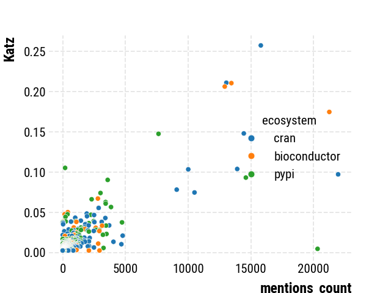
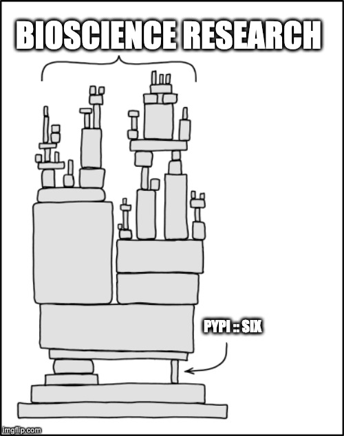
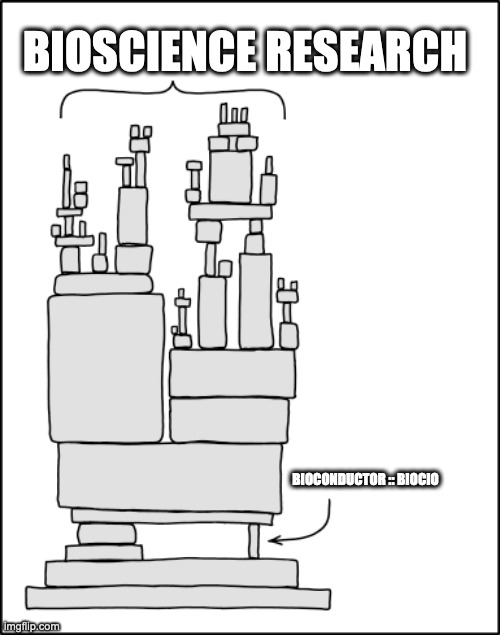
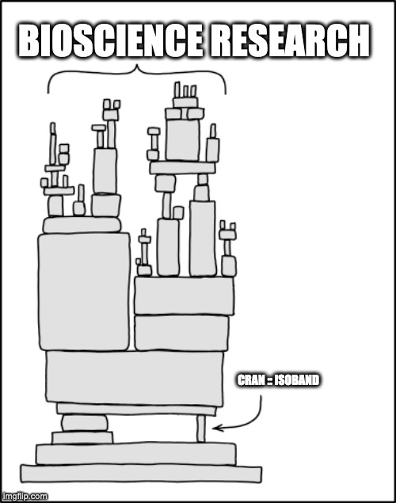

<!--
SPDX-FileCopyrightText: 2023 Brown, E. M., Nesbitt, A., Hébert-Dufresne, L., Veytsman, B., Pimentel, J. F., Druskat, S., Mietchen, D.

SPDX-License-Identifier: CC-BY-4.0
-->

# Exploring the dependencies of the CZI mentions dataset

## Exploring the Dependencies of Mentioned Software in the CZI Software Mentions Dataset

We construct a graph of dependencies between software packages mentioned in the CZI Software Mentions Dataset. We then use the Katz centrality score to rank the importance of each software package. The data is [available](https://doi.org/10.5281/zenodo.10048132) as `Brown, E. M. (2023). A Dependency Graph for 460,000 Papers and Their Software Mentions from the CZI Software Mentions Dataset (1.0.0) [Data set]. CZI Research Software Hackathon. Zenodo. https://doi.org/10.5281/zenodo.10048132`.

We find some interesting examples of "most important" (given that some of the ecosystems are incorrectly labelled):
* [PACE](https://forensiccoe.org/pace/) is the most mentioned software but may not be the most "critical" / connected
* [VELVET](https://bioinformaticshome.com/tools/wga/descriptions/Velvet.html#gsc.tab=0) is seemingly the "most critical" / connected software that has very few mentions
* [PERMANOVA](https://rdocumentation.org/packages/PERMANOVA/versions/0.2.0/topics/PERMANOVA) is seemingly a "true" (mentioned and identified in the correct ecosystem) which is incredidly important and correct and has a number of mentions.

### Software That is Important but has No Mentions in the Literature

All of these are NEVER mentioned.

PyPI - `six`: Python 2 and 3 compatibility utilities.

Bioconductor - `BiocIO`: a package for basic file handling and some formats

CRAN - `isoband`: An R package to generate contour lines and polygons.

## Exploring the Dependencies of Imported Software within Notebooks from the Combined CZI Software Mentions Dataset and 

## About this project

This repository was developed as part of the [Mapping the Impact of Research Software in Science](https://github.com/chanzuckerberg/software-impact-hackathon-2023) hackathon hosted by the Chan Zuckerberg Initiative (CZI). By participating in this hackathon, owners of this repository acknowledge the following:
1. The code for this project is hosted by the project contributors in a repository created from a template generated by CZI. The purpose of this template is to help ensure that repositories adhere to the hackathon’s project naming conventions and licensing recommendations.  CZI does not claim any ownership or intellectual property on the outputs of the hackathon. This repository allows the contributing teams to maintain ownership of code after the project, and indicates that the code produced is not a CZI product, and CZI does not assume responsibility for assuring the legality, usability, safety, or security of the code produced.
2. This project is published under a MIT license.

## Code of Conduct

Contributions to this project are subject to CZI’s Contributor Covenant [code of conduct](https://github.com/chanzuckerberg/.github/blob/master/CODE_OF_CONDUCT.md). By participating, contributors are expected to uphold this code of conduct. 

## Reporting Security Issues

If you believe you have found a security issue, please responsibly disclose by contacting the repository owner via the ‘security’ tab above.

## Licenses

Licenses are annotated according to the [REUSE Specification v3.0](https://reuse.software/spec/). 
Please see the single files or respective `.license` files for the actual licenses.

Generally, 

- code is licensed under the MIT license
- documents are licensed under CC-BY-4.0
- some data files and other files are licensed under CC0-1.0

## Cite this project

To cite this project, please use the metadata in [`CITATION.cff`](CITATION.cff).
You can also copy and paste an APA-formattes string, or a BibTeX entry directly from the "Cite this repository" widget on GitHub.
