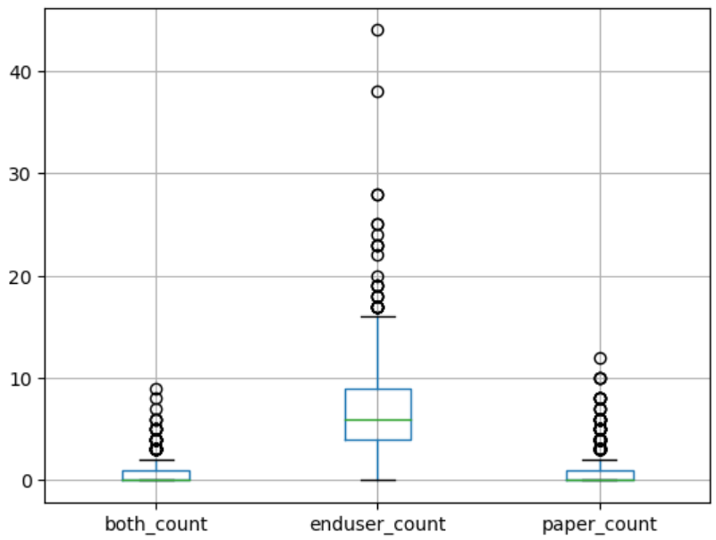
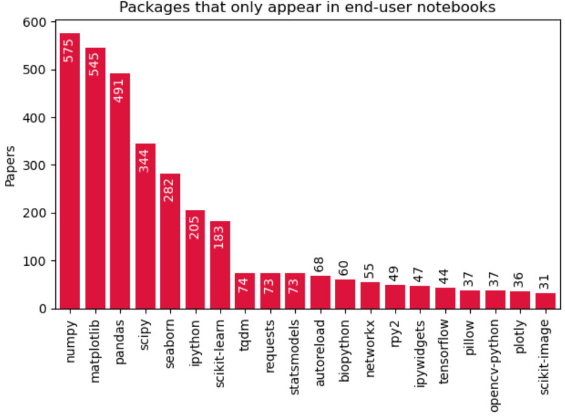
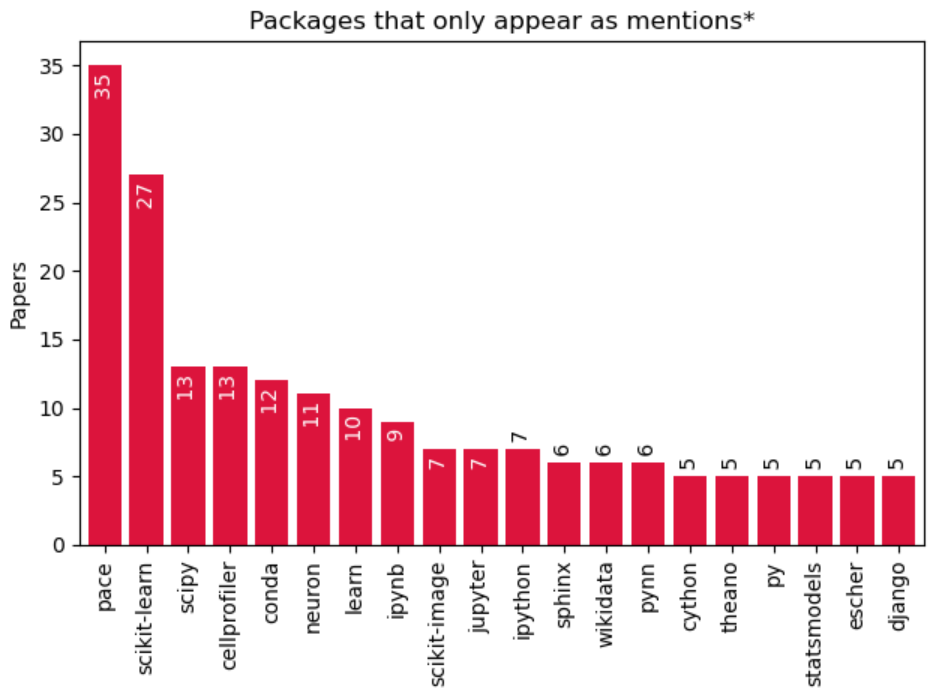
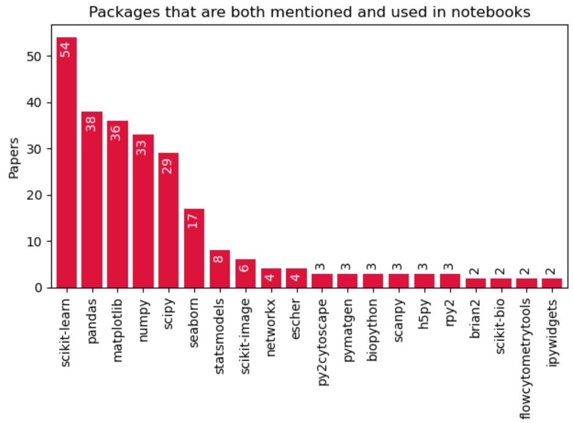

<!--
SPDX-FileCopyrightText: 2023 Brown, E. M., Nesbitt, A., Hébert-Dufresne, L., Veytsman, B., Pimentel, J. F., Druskat, S., Mietchen, D.

SPDX-License-Identifier: CC-BY-4.0
-->

# Bridging the gap between software mentions and end-user research code dependencies

The choco team is using the [CZI Software Mentions](https://datadryad.org/stash/dataset/doi:10.5061/dryad.6wwpzgn2c) to assess the impact of software on science and discover what are the critical packages used by scientists directly or indirectly through transitive dependencies. The dataset is massive and provides a huge extraction of over 1 million software mentions from the body of 2.4 million papers in the NIH PMC-OA Commercial subset, which allows for this type of analysis.

However, the CZI Mentions dataset overlooks the existence of indirect citations that may occur in research software. Notably, some scientists cite supplementary material with their own analysis and associated code for reproducibility. Such supplementary material may have references (via descriptors and module import) to other software that the scientists did not mention explicitly in their papers.

Hence, the initial goal of this branch-project was to extend the impact analysis of the choco team to evaluate the impact of packages that are mentioned indirectly in supplementary material, trying to understand if there are differences when compared to the mentions analysis.

Due to time constraints of the hackathon, we reduced the scope of this branch-project to a single research question (for now):

RQ1- What are the differences between the software scientists mention and the software they use?

The answer to this question allows to evaluate if it is worth it to pursue the analysis of indirect software citations in supplementary material.

(Please note that this is a work in progress, and this report only covers what has been done during the hackathon in the context of this branch-project. There are many quality issues that need to be solved)

## Method

We used three datasets to answer the RQ. The [CZI Software Mentions](https://datadryad.org/stash/dataset/doi:10.5061/dryad.6wwpzgn2c) is the baseline of this work. It contains software mentions from over 1 million papers in the biomedical literature. To study biomedical papers that had their own code as supplementary material, we used the [Dataset of a Study of Computational reproducibility of Jupyter notebooks from biomedical publications](https://zenodo.org/records/8226725). It has 5240 repositories with Jupyter Notebooks associated with 3467 papers from PubMed. However, only 709 of them exist on the CZI Mentions Repository. Hence, we restricted the analysis to this number of papers. Finally, to map package names to package ids used in the CZI Mentions Dataset, we used the [Package and Dependency Metadata for CZI Hackathon](https://zenodo.org/records/10031224), as it has a recursive dependency list of packages from PyPI.

In addition to using these datasets, we built some tools, scripts, and notebooks to extract imports from projects, discover packages from imports, and analyze the mismatches between indirect citations in supplemental material and direct mentions in the datasets.

### Extracting imports from projects

To restrict the scope of this project, currently we only extract imports from Python files and Python Notebooks. The implementation of [extract_imports.py](extract_imports.py) is based on the [JupArc](https://github.com/gems-uff/jupyter-archaeology/) implementation, which was used in the past to extract imports from Jupyter notebooks in the paper [Understanding and improving the quality and reproducibility of Jupyter notebooks](https://link.springer.com/article/10.1007/s10664-021-09961-9). It uses an AST visitor to collect `import` and `import_from` statements, as well as `%load_ext` invocations.

It is possible to run this file as a standalone script with the command

```
$ python extract_import.py <path> --csv
```

The path can be a python file, a notebook file, or a directory.

### Extracting packages from imports

Discovering the package that represents an import in PyPI is not a trivial task. A package on PyPI can provide module names that are completely different than their names in the package manager. Moreover, it can also provide multiple module names, and multiple packages can provide the same module name. Finally, a local module can overload a name and take priority. Hence, to extract packages names from module imports we devised four heuristics:

1- Check if the module is local. We check if its names corresponds to the name of a directory or Python file in the repository using the same strategy employed on [Understanding and improving the quality and reproducibility of Jupyter notebooks](https://link.springer.com/article/10.1007/s10664-021-09961-9). If it is a local module, we exclude it from the package searching

2- Check if the module is builtin. We use the `stdlib_list` module to get a list of builtin modules and exclude these from the package search.

3- [in progress] Check if the module exists in a map of import to PyPI package. We are building this map using the notebook [PyPI-MAP.ipynb](PyPI-MAP.ipynb), which was initially the script [create_package_to_importable_name_map.py](create_package_to_importable_name_map.py). This is probably the most reliable heuristic, as it is an actual map of import to package. However, it has two limitations:

- Currently, the map is very incomplete (and it tends to always be incomplete, with the release of new packages and updates). At this stage, it covers less than 5% of the packages that exist on PyPI. 

- Since multiple packages may publish the same module name, we use another heuristic to select the most likely package: the number of downloads of a given package in the past 30 days (more about that next)

4- Check if the import name matches a package name after normalization. For this check, we ran a Google [BigQuery](pypi-bigquery.sql) on [PyPI](https://packaging.python.org/en/latest/guides/analyzing-pypi-package-downloads/) to collect all [PyPI package names and download counts using pip in the past 30 days](pypi-bq-results.csv) as of 2023-10-26. Since this heuristic comes after the third one, it may not cause many issues once the coverage of the third improves.

It is possible to extract packages from a python file, python notebook, or repository using the [extract_packages.py](extract_packages.py) script with the same command line interface as the `extract_imports.py`:

```
$ python extract_exports.py <path> --csv
```

### Extracting packages from the PubMed notebook imports

The [Dataset of a Study of Computational reproducibility of Jupyter notebooks from biomedical publications](https://zenodo.org/records/8226725) already has imports from notebooks, hence the process of extracting imports and packages is different than what I described before (although it has the same rules and heuristics)

The first step here is to select a subset of PubMed papers that appear both in the [CZI Software Mentions](https://datadryad.org/stash/dataset/doi:10.5061/dryad.6wwpzgn2c) dataset and in the PubMed notebooks dataset. To do that, we use the [find_shared_doi.ipynb](find_shared_doi.ipynb), which produces [shared.json](shared.json).

Then, in the [doi_to_notebook_packages.ipynb](doi_to_notebook_packages.ipynb), we load the imports from each paper, and we use the `extract_packages.py` as a module to map the imports into packages. From the packages, we use the [Package and Dependency Metadata for CZI Hackathon](https://zenodo.org/records/10031224) to map them to ids used in the CZI dataset and create two files: [enduser_doi_to_czi.json](enduser_doi_to_czi.json) with the resulting map of packages used by doi, and [unknown_czi.json], which is used internally in the project to extract recursive dependencies from packages that are not part of the existing Dependency Metadata that was extracted from the CZI mentions. New depedencies are stored on [unknown_pypi_with_mentions.ndjson.tar.gz](unknown_pypi_with_mentions.ndjson.tar.gz).

### Analyzing the mismatches

Finally, the notebook [compare_enduser_packages_to_paper_mentions.ipynb](compare_enduser_packages_to_paper_mentions.ipynb) compares the software mentions in the CZI Software Mentions dataset to the indirect citations in the notebooks.


## Preliminary results

We found 375 packages that were used by end-user research notebooks that were not mentioned in any of the papers: abipy, abutils, actonet, adjusttext, afqinsight, aicsimageio, aicssegmentation, aiida, allensdk, amici, anndata2ri, apiclient, appyter, asaplib, assimp, astroml, autoencoder, autograd, autoreload, awkward, awkwardql, azureml, baselines, bayesflow, bdpy, beakerx, bebi103, benchml, bertviz, biocommons, bioexplorer, blackcellmagic, bluegraph, bluepyefe, bluepysnap, bluesearch, bond, bonesis, bootstrapped, botometer, bqplot, brainiak, brainsmash, brainspace, branca, bravado, brewer2mpl, brian2tools, cabean, calour, capalyzer, casq, celerite, celluloid, charcoal, cimcb, cirq, clawpack, clodsa, cogent3, colicoords, common, condacolab, configspace, constants, convis, cotengra, croissance, crossref, ctk, cuml, cupy, cylouvain, cyrand, cytopy, datapackage, datashader, dcor, decouple, deepdish, descartes, diffusers, distributed, dnaskittleutils, easydict, easyeeg, epypes, evaluators, fastapi, fastprogress, feast, feather, fermilib, filelock, fitter, flybrains, flywheel, fqe, fretbursts, frimcla, frogress, funowl, fury, geoplot, george, getmac, glambox, gmql, goodtables, gouda, graspy, grove, gudhi, gurobipy, gym, gymnasium, h5pyd, hail, hdf5plugin, hdf5storage, helpers, hermione, hippounit, hlda, holoviews, horovod, htmlmin, hvplot, iambcodes, image3c, iminuit, imports, ineqpy, instamatic, iptk, ipycanvas, ipyfilechooser, ipykernel, ipymol, ipympl, ipytransferfunction, ipyupload, ipywebrtc, ism, itables, iversions, jacobi, javabridge, jax, jnius, joypy, jsd, json2html, jupyterthemes, jwt, kaleido, kaplanmeier, kgforge, layers, lensfunpy, libsonata, litus, livelossplot, loguru, lolopy, loss, m2g, mackinac, mbuild, mdai, mdanalysistests, meautility, metaknowledge, metric, metroid, mhctools, miscnn, monty, morgana, morphio, morphopy, morphsnakes, motionclouds, moviepy, movingpandas, mpathic, mpbn, mpltools, mrcnn, msmexplorer, mumot, mwparserfromhell, myterial, natsort, nbformat, nbparameterise, nbtools, ncpol2sdpa, ndex2, neat, netcdf4, netpyne, networkunit, neurodsp, neurodynex, neurokernel, neurom, neuronunit, neurotune, nevergrad, niwidgets, nordic, notebook, numcodecs, nxviz, oauth2client, oddt, odmltables, omg, omicexperiment, openfermion, optax, osgeo, owslib, packaging, palettable, pandas2pgfplots, pandasql, pastas, pathme, pathos, pcaplib, pdbio, pdfrw, pdkit, peakdetect, periodictable, petab, phate, phylics, picturedrocks, piexif, pixiedust, plaidml, pmlb, prettytable, probflow, prodmx, progressbar, projectq, py3dmol, py4cytoscape, pybliometrics, pybravo, pybroom, pychomp, pycirclize, pycocotools, pycorenlp, pycountry, pycroscopy, pydotplus, pyedflib, pygifsicle, pyinsar, pykeen, pykov, pylandstats, pylatexenc, pymatbridge, pymed, pymo, pymolnetenhancer, pynsid, pynwb, pyod, pyodbc, pypandoc, pypdftk, pyprind, pyproblib, pyquaternion, pyquil, pyrates, pyrdf2vec, pysapc, pysces, pyserialem, pysmfish, pystablemotifs, pytablewriter, pyupset, pyversions, pyvips, pyzx, qgrid, quantities, quaternion, qubiter, quimb, qutip, rascal, rawpy, reachy, redo, renderapi, reprophylo, rickpy, rlp, robotreviewer, rocrate, roman, rutishauserlabtonwb, sage, sampledata, samuroi, sbol2, scaffoldgraph, scgen, scifireaders, sciluigi, sciunit, scprep, scrypt, scyjava, selfies, showit, sidpy, simpletransformers, six, skdaccess, sketches, slugify, snappy, snipgenie, sqlparse, ssms, starlette, statsforecast, stimulus, stratipy, stytra, svgutils, targetdb, tesserocr, thunder, tidyms, timm, timml, tnorm, tomotopy, torchmetrics, torchsampler, trajectorynet, treesap, treeswift, triangle, unidecode, urllib3, vcfnp, vdw, vimms, vincent, viresclient, visualkeras, watchdog, watermark, webcolors, widgetsnbextension, wikidataintegrator, wrangle, xformers, xmltodict, yellowbrick, zoopt

Next, we analyzed the packages that appear both in the CZI Mention dataset and in the supplementary material (i.e., we excluded these 375 packages from the analysis), and we tried to observe three relationships in the following figure:



- "Both" indicates packages that appear both in the paper and in the supplementary notebooks
- "Enduser" indicates packages that appear only in the supplementary notebooks
- "Paper" indicates packages that appear only in the mentions dataset


Note that there is an evident mismatch between the packages the scientists mention and the packages that they use in their notebooks, with many packages appearing only on their end-user code and some appearing only on the paper. The reason for some packages appearing only on the paper may be due to the extraction of packages occurring only from notebooks, when using the [Dataset of a Study of Computational reproducibility of Jupyter notebooks from biomedical publications](https://zenodo.org/records/8226725). On the other hand, the reason for some packages not being mentioned in the paper requires further investigation.

Next we investigated the top 20 packages that appear in each category:







### Conclusion and future work

This project was able to show the mismatch of indirect citation and software mentions (RQ1) in the literature, but there are still some processing and analyses to do to assess the impact of research and to improve the accuracy of the data. Thus, the next steps are:

- Continue the data collection that is in progress to improve accuracy
-- Merge files in the [pypi_map](pypi_map) folder
- Investigate reasons why scientists do not mention the software they used. Is it the type of software? Do pervasive software (the ones with the most downloads) receive fewer mentions?
- Plug the end-user package dependencies into the choco team algorithm that assesses the impact of software and contrasts the results with the mention-based analysis
- Extend the supplementary material dataset to find other end-user research codes on different papers and repositories
